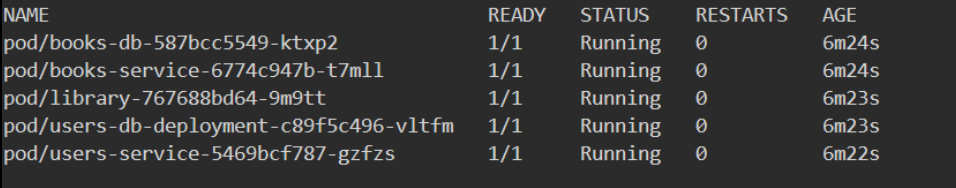
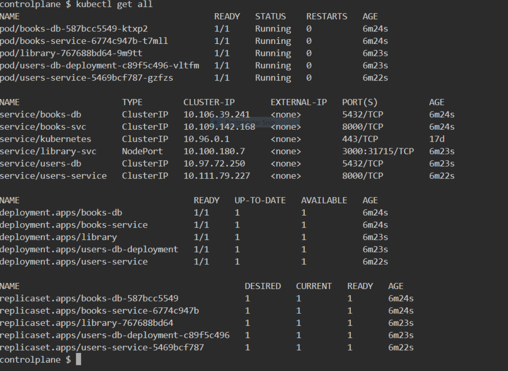
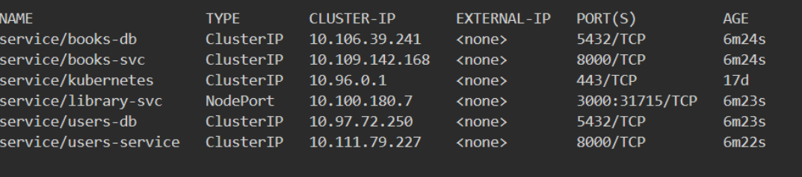
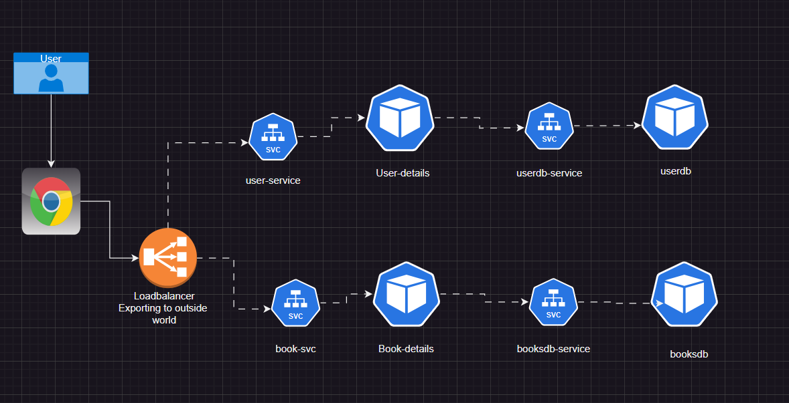
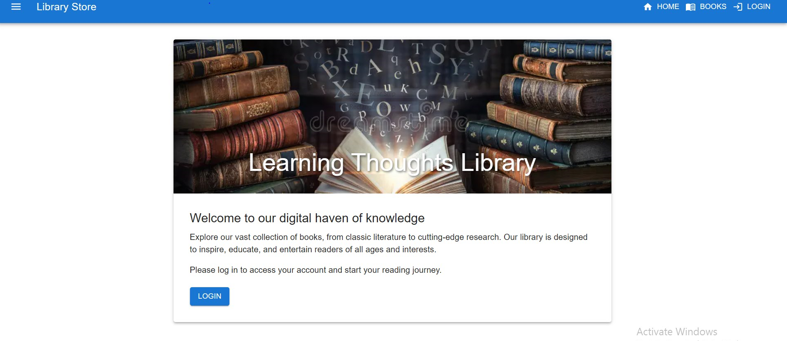

## Library Management System

### Prerequisites

1. Make Sure you have docker,k8s,python Installed in your local system or virtual machine and all the configuration has been made up of.


# Technical Stack

- **users-service**:

  - REST API
  - Python
  - FastAPI
  - **user-db**:
    - Postgres

- **books-service**:

  - REST API
  - Python
  - FastAPI
  - **user-db**:
    - Postgres

- **library-frontend**:
  - React JS

#### To run book database

- image: postgres:15-alpine
- environmental variables:
  - POSTGRES_USER: user
  - POSTGRES_PASSWORD: password
  - POSTGRES_DB: booksdb
- port: 5432

#### To run book Service

- image: shaikkhajaibrahim/libbookssvc:1.0
- environmental variables:
  - DATABASE_URL: “postgresql://:@:5432/“
  - SECRET_KEY: ‘YtDEVWnL35aAIP-5yxeLjAZ49R920-mMNDfwPyWULu63HFsYzo0f-LO2InxC8eu428k’
- port: 8000

#### To run user database

- image: postgres:15-alpine
- environmental variables:
  - POSTGRES_USER: user
  - POSTGRES_PASSWORD: password
  - POSTGRES_DB: booksdb
- port: 5432

#### To run User Service

- image: shaikkhajaibrahim/libbookssvc:1.0
- environmental variables:
  - DATABASE_URL: “postgresql://:@:5432/“
  - SECRET_KEY: ‘YtDEVWnL35aAIP-5yxeLjAZ49R920-mMNDfwPyWULu63HFsYzo0f-LO2InxC8eu428k’
- port: 8000

#### To run library web-store

- image: shaikkhajaibrahim/libwebstore:1.0
- environmental variables
  - REACT_APP_BACKEND_API_URL: http://:8000/api/v1
  - REACT_APP_BOOKS_API_URL: http://:8000/api/v1/books
  - REACT_APP_USERS_API_URL: http://:8000/api/v1/users
- port: 3000

## Yaml file

- Now write a Yaml file for

  - BooksDB
  - BooksDetails
  - UserDB
  - UserDetails
  - Libraryappplication

  [ReferHere](https://kubernetes.io/docs/reference/generated/kubernetes-api/v1.31/#envfromsource-v1-core)

Save the changes and run the following command to create an deployment set for an above application

```bash
# This is a comment in bash
 kubectl apply -f .
```

If You want to run any particular yaml file then

```bash
# This is a comment in bash
 kubectl apply -f books-db.yaml
 kubectl apply -f books-svc.yaml
 kubectl apply -f usersdb.yaml
 kubectl apply -f users-svc.yaml
 kubectl apply -f library.yaml
 kubectl apply -f ConfigMap.yaml
```

- command to get pod details

```bash
# This is a comment in bash
kubectl get pods
```



- command to get all resources details

```bash
# This is a comment in bash
kubectl get all
```



- command to get service

```bash
# This is a comment in bash
kubectl get svc
```




How application get access thrugh service



**Access it using loadbalancer-service** 

http://:svcport/docs

